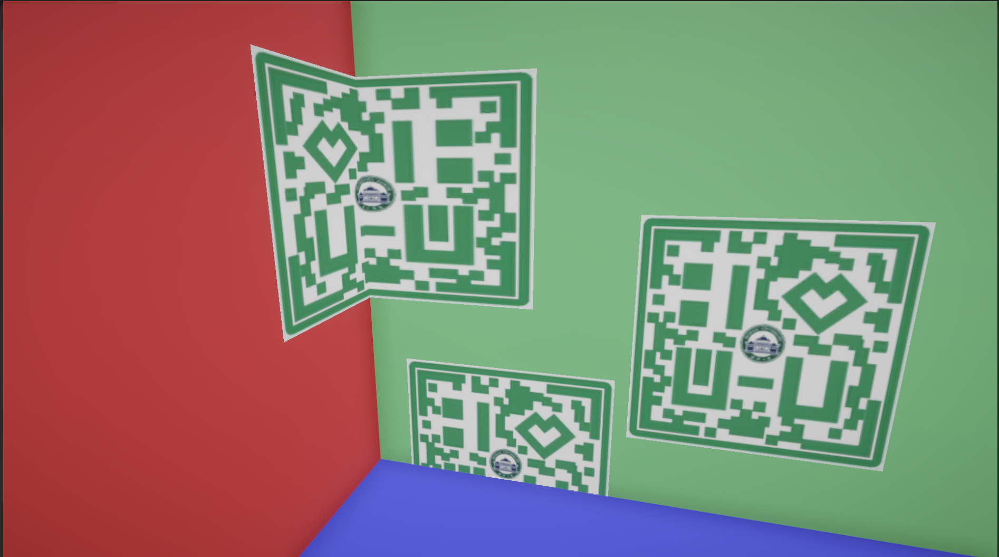

# ScreenSpaceDecal

### 效果

### 原理

若贴花是一个Cube

- vert
  - 记录Cube上点的屏幕空间UV、viewRayOS
- frag
  - 读深度
  - OS空间贴花坐标 = OS空间相机坐标 + viewRayOS x 深度
  - 在OS空间，将Cube外（贴花范围）的像素Clip掉
  - 根据OS坐标替代UV采样贴图

### 参考

[Colin Github](https://github.com/ColinLeung-NiloCat/UnityURPUnlitScreenSpaceDecalShader/blob/master/URP_NiloCatExtension_ScreenSpaceDecal_Unlit.shader)
